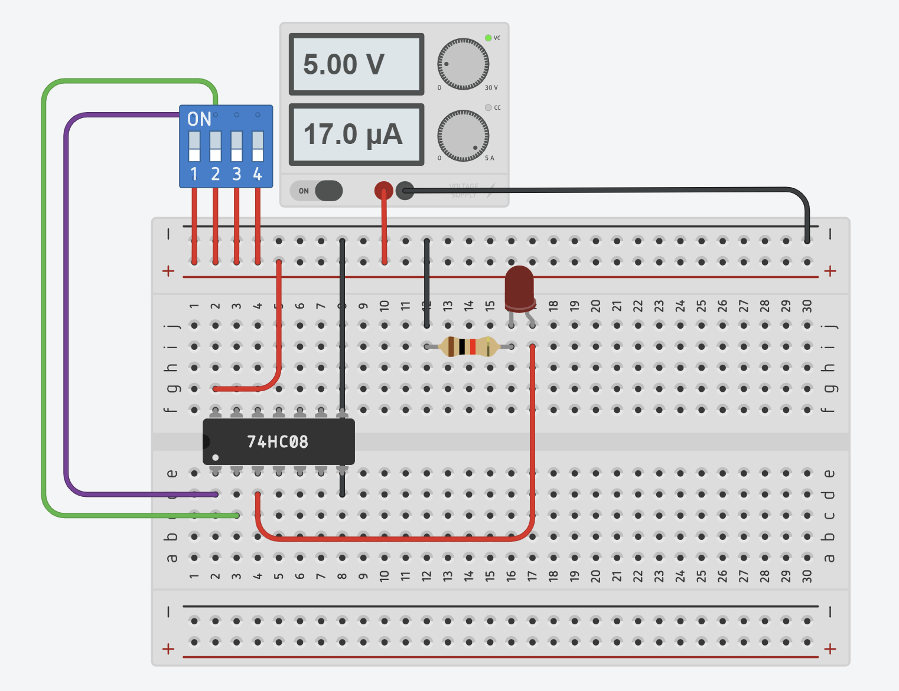
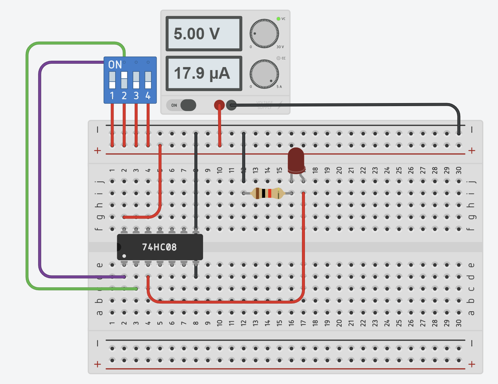
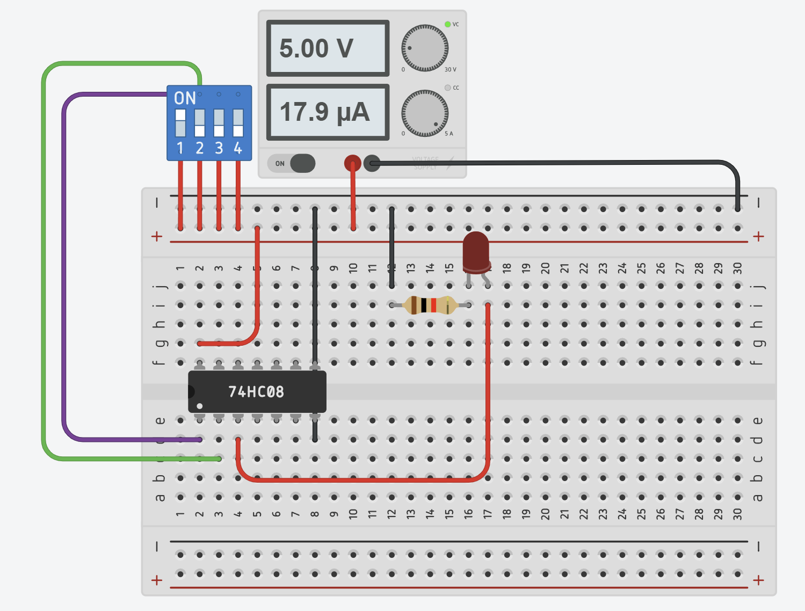
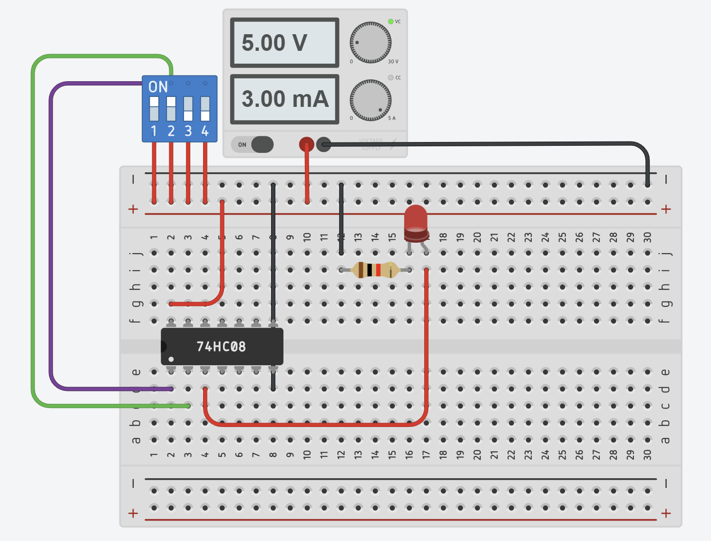
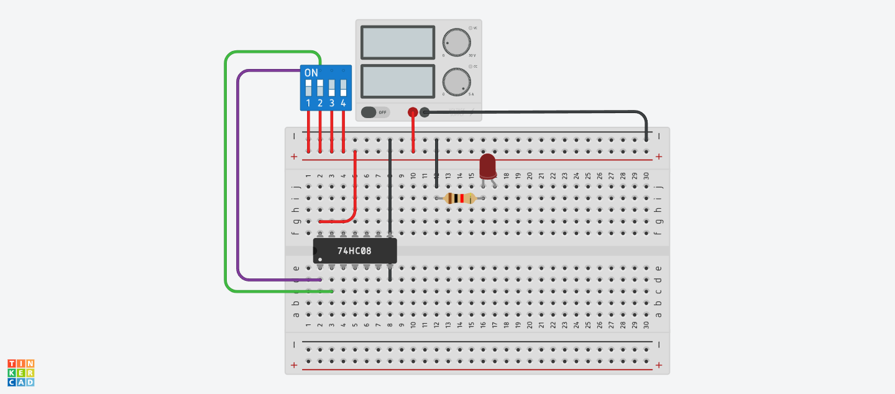
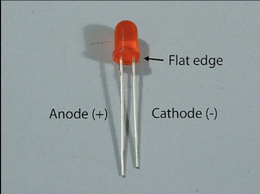

# Case Study Modul 1 : Pengenalan Dasar Rangkaian Digital

```txt
Nama   : Elias Rechoum
NPM    : 2406354045
```

Pada tugas pendahuluan, anda telah membuat rangkaian sederhana untuk menyalakan LED. Pada Case Study, LED akan dinyalakan menggunakan IC 7408 berdasarkan datasheet. Untuk itu, ikuti lah langkah-langkah dibawah ini.


### Praktik

1. Buatlah rangkaian baru pada Tinkercad, tambahkan breadboard, baterai 9V, LED, dan IC 7408 pada breadboard. Tidak perlu dihubungkan terlebih dahulu.
2. Bukalah datasheet dari IC 7408. Anda dapat menggunakan datasheet pada link berikut : https://www.farnell.com/datasheets/59359.pdf
3. Dari bagian General Description, sebutkan apa kegunaan dari IC 7408! (5 poin)
   #### Jawaban singkat: 
   
   IC7408 memiliki 4 logic gate AND yang independen.
4. Hubungkan baterai 9v pada bagian power strip dari breadboard.
5. Dari bagian Connection Diagram, jelaskan lokasi pin VCC dan GND, apa yang seharusnya dihubungkan pada VCC dan GND? (5 poin)

   #### Jawaban singkat: 

   Pin VCC terletak di baris atas paling kiri, dan harus terhubung ke terminal positif sumber daya. Pin GND terletak di baris bawah paling kanan, dan harus terhubung ke terminal negatif sumber daya.
6. Hubungkan VCC dan GND dari power strip breadboard sesuai dengan jawaban anda sebelumnya.
7. Letakkan IC pada bagian tengah breadboard.

   
8. Letakkan LED pada breadboard, dan hubungkan Cathode dari LED dengan resistor menuju ground seperti yang telah dikerjakan pada Tugas Pendahuluan.
9. Dari bagian connection diagram, gunakan AND gate pertama (A1, B1, dan Y1) pada Tinkercad.
10. Hubungkan VCC dari dua buah port (lubang) power strip breadboard menuju pin A1 dan B1 pada IC 7408 (1A dan 1B pada Tinkercad)
11. Hubungkan output dari AND gate yaitu pin Y1 (Output 1 pada Tinkercad) pada bagian Anode dari LED.
12. Pada datasheet, perhatikan bagian function table, dalam hal ini H berarti High Logic Level (dihubungkan dengan VCC) dan L berarti Low Logic Level (Dihubungkan dengan GND), berdasarkan tabel tersebut, apa output seharusnya jika pada input IC dihubungkan High dengan High? (5 poin)

    Jawaban singkat:Seharusnya output IC jika inputnya High dan High adalah High.
13. Run Simulation Tinkercad dan perhatikan LED, bila LED menyala maka ia dalam kondisi High, sedangkan bila ia padam, maka ia dalam kondisi Low. Pastikan output sudah sesuai dengan function table sebelum lanjut ke nomor selanjutnya.
14. Namun, perhatikan bahwa IC akan meledak atau terbakar ketika simulasi dijalankan. Buka halaman kedua dari datasheet anda, lalu perhatikan tabel **Recommended Operating Conditions**. Berdasarkan tabel tersebut, berapakah tegangan operasional yang disarankan untuk VCC? (5 poin)

    Jawaban singkat: 5 Volt
15. Dapat diamati bahwa baterai yang memiliki tegangan sebesar 9V tidak sesuai untuk IC yang digunakan, maka ubahlah baterai tersebut dengan Power Supply yang digunakan pada Tugas Pendahuluan.
16. Setelah melakukan perubahan, kembali Run Simulation. Pastikan bahwa kondisi LED dan IC sudah sesuai dan tidak meledak.
17. Selanjutnya, anda akan melakukan pengujian truth table (function table) IC 7408 berdasarkan datasheet. Untuk memudahkan prosesnya, anda akan menggunakan Dip Switch.
18. Dip switch bertindak sebagai saklar yang dapat dengan mudah mengubah nilai High atau Low dari input tanpa harus mengganti hubungan kabel. Contoh penggunaannya dapat dilihat digambar berikut.
    
19. Hubungkan dipswitch pada rangkaian anda, coba melakukan Run Simulation lalu nyalakan pin 1 dan 2 pada dip switch, pastikan bahwa output sesuai dengan rangkaian pada nomor 16.
20. Jika sudah sesuai, Lengkapilah tabel berikut ini. Apakah hasil akhir rangkaian anda sesuai dengan function table pada datasheet? (10 poin)


    | Inputs  | Output Datasheet | Output Sebenarnya | Screenshot Output |
    | ------- | ---------------- | ----------------- | ----------------- |
    | LL (00) | L                | L               |        |
    | LH (01) | L                | L               |        |
    | HL (10) | L                | L               |        |
    | HH (11) | H                | H               |        |

### Analisis

1. Berikan analisis berupa paragraf yang menjelaskan kegiatan dan aplikasi teori dan modul anda pada Case Study ini, sertakan screenshot dan link rangkaian Tinkercad anda (30 poin).

   #### Jawaban:
   Rangkaian IC7408 ini menggunakan teori Logic Gate AND untuk menyalakan sebuah LED. LED hanya akan nyala jika kedua input adalah High, dan tidak akan menyal

   Screenshot Rangkaian:
   

   [Link Rangkaian]("https://www.tinkercad.com/things/ai69f8TxL0T-modul-1-")

2. Perhatikan penggunaan LED pada rangkaian anda, jelaskan apa yang terjadi ketika posisi Anode dan Katode dari LED di balikkan! (dapat anda demonstrasikan dengan mencantumkan SS rangkaian) (10 poin)
   
   #### Jawaban:

   Jika posisi Anode dan Katode dibalikkan, LED tidak akan menyala karena LED,karena LED hanya memungkinkan arus mengalir dalam satu arah, dan bisanya tidak akan ada kerusakan apapun.
   
3. Pada LED fisik di dunia nyata, bagiamana anda membedakan posisi dari Anode dan Katode LED? (10 poin)
   
   #### Jawaban:

   Di dunia nyata, pin anode pada sebuah LED lebih panjang dari pin katode, dan sisi katode akan mempunyai tepi yang datar.

   

4. Perhatikan posisi Pin IC pada rangkaian anda, apakah dampak jika posisi pin tertukar pada IC dan bagaimana anda membedakan posisi dari pin IC pada IC fisik? Anda dapat menggunakan gambar berikut sebagai referensi (20 poin)
   

   #### Jawaban:
   Jika posisi pin Input dan Output tertukar pada IC fisik, IC akan meledak.

   Jika posisi VCC dan GND tertukar pada IC fisik, IC akan meledak.

   Untuk membedakan pin IC fisik, kita dapat mencari Notch atau titik yang terletak pada IC. Biasanya Notch terletak pada bagian kiri IC. Setelah mengidentifikasi sisi kiri dari IC, kita dapat menggunakan datasheet untuk membedakan pin-pin pada IC.
   
5. Berikan kesimpulan praktikum modul ini dalam bentuk poin-poin, untuk jawaban yang maksimal, jelaskan kembali apa saja informasi yang dapat anda peroleh dari datasheet, serta jelaskan hal baru yang anda pelajari dari praktikum hari ini! (10 poin)

   - IC7408 adalah sebuah IC yang memiliki 4 AND gate. 
   
   - IC7408 memiliki 8 input dan 4 output. 
   
   - Voltage operasi normal IC7408 adalah 5 Volt.

   - Datasheet IC7408 menjelaskan layout pin pada IC, dimensi fisik, kondisi operasi yang normal dan karakteristik elektrikal dari IC7408.

   - Pada praktikum hari ini, saya pelajari cara menghubungkan IC ke sumber daya cara menggunakan dip switch untuk membuat manipulasi input ke IC, dan cara menggunakan output dari IC untuk menyala sebuah LED.
