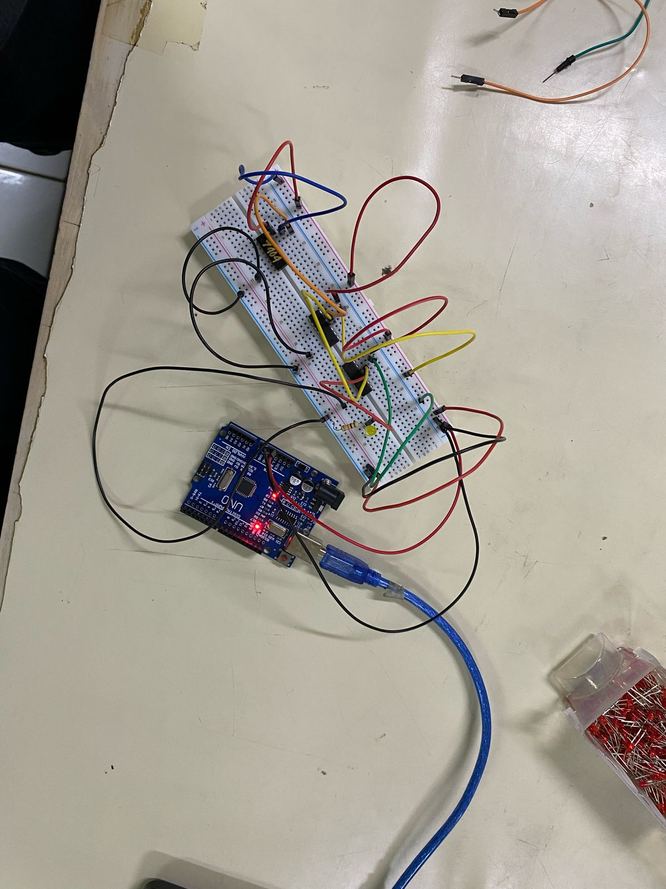

# Case Study - Boolean Algebra And Basic Logic Gates

``` txt
Nama        : Elias Rechoum
NPM         : 2406354045
Kelompok    : A13
Rekan Kerja : Altaf Farzana (2406355754)
```

## 1. Praktikum - Buatlah rangkaian asli secara fisik yang memenuhi ketentuan sesuai kriteria berikut! (60 Poin)

Pada saat TP, kalian sudah membuat rangkaian digital di Tinkercad untuk membantu Mr. Kim dalam mencari "Soulmate"-nya. Baru-baru ini, ia hampir tertabrak truk tronton di jalanan, sehingga ia mulai menjadi agamis dan sedikit meralat kriterianya dalam mencari "Soulmate", yakni:

(`Cantik` atau `Tidak Berpenyakitan`) dan `Agamis`

Bantulah Mr. Kim dalam mencari "Soulmate"-nya lagi dalam bentuk rangkaian digital fisik!

Fungsi Boolean :
`F(A,B,C) = A(B'+C)`

### Truth Table dan Foto Bukti Rangkaian Fisik per-kombinasi Input (Sesuaikan variabel A, B, dan C dengan kriteria Agamis, Berpenyakitan, Cantik)

|  A  |  B  |  C  |  Output  |           Foto Rangkaian              |
|-----|-----|-----|:--------:|:-------------------------------------:|
|  0  |  0  |  0  |   `0`    |                 |
|  0  |  0  |  1  |   `0`    |                 |
|  0  |  1  |  0  |   `0`    |                 |
|  0  |  1  |  1  |   `0`    |                 |
|  1  |  0  |  0  |   `1`    |                 |
|  1  |  0  |  1  |   `1`    |                 |
|  1  |  1  |  0  |   `0`    |                 |
|  1  |  1  |  1  |   `1`    |                 |

## 2. Teori - Misalnya, rangkaian ini sudah selesai. Pasti akan ada kombinasi-kombinasi yang menghasilkan sinyal `0`, atau tidak layak menjadi soulmate, bukan? Jika Anda diminta untuk menyalakan lampu untuk setiap kombinasi input yang bernilai `0` (seperti membuat mereka jadi `1`), apa 1 IC yang akan Anda gunakan, dan mengapa? (Harus memakai IC yang sudah ada pada rangkaian dan tidak diperbolehkan menambah IC lain)  (10 poin)

Untuk mengganti setiap output `0` menjadi `1`, kita bisa menggunakan gate `NOT` dengan `IC7404`.

Kita menggunakan `NOT` gate karena fungsi `NOT` adalah menegasi inputnya, yaitu:

```txt
NOT 1 = 0
NOT 0 = 1
```

Dengan menggunakan gate `NOT` kita bisa mengganti semua output `0` jadi `1`

## 3. Teori - Misalnya, IC AND (7408) habis untuk praktikum ini. Bagaimana Anda bisa menghasilkan output yang tetap benar hanya dengan menggunakan IC yang ada (OR, NOT, tidak boleh menggunakan IC logika kompleks) (10 poin)

Theorem DeMogran menyatakan bahwa :

``` python
1. (not A) and (not B) = not (A or B)

2. (not A) or  (not B) = not (A and B)
```

Jika kita tidak punya AND gate, kita dapat menggunakan `NOT (A OR B)` atau juga disebut sebagai `NAND` untuk mensubstitusikan `AND`. Ouput dari gate `NAND` adalah negasi dari gate `AND`, yaitu `NOT (A AND B)`. Untuk mengganti ouput `NAND` untuk menjadi `AND`, tinggal menambah `NOT` di depannya.  

Fungsi boolean tanpa `AND` adalah sebagai berikut:

`F(A,B,C) = (A'+(B'+C)')'`

atau 

```python
f(a,b,c) =  not ( (not a) or (not (not b or c)))
```

## 4. Analisis & Kesimpulan - Berikan analisis dan kesimpulan untuk percobaan praktikum kali ini! Analisis harus dalam bentuk paragraf dan mendeskripsikan apa yang kalian lakukan di praktikum ini beserta tujuannya. Kesimpulan harus disajikan dalam bentuk poin (minimal 3 poin) ! (20 poin)

### Analisis

Pada praktikum hari ini, saya merakit rangkaian digital mengguna 3 IC yaitu `7404 (NOT)`,`7432 (OR)` dan `7408 (AND)` untuk menghasilkan output dari fungsi boolean `A AND ((NOT B) OR C)`, dan mengisi Truth Table dengan output dari rangkaian tersebut. Untuk menyampilkan output, saya menggunakan sebuah LED yang terhubung ke output IC and resistor yang terhubung ke ground. Sumber daya yang dipakai untuk rangkaian tersebut adalah pin 5V dari sebuah Arduino UNO yang terhubung ke laptop.  

### Kesimpulan

- `IC 7404` adalah sebuah IC yang memiliki 6 gate `NOT`.
- `IC 7408` adalah sebuah IC yang memiliki 4 gate `AND`.
- `IC 7432` adalah sebuah IC yang memiliki 4 gate `OR`.
- Jika kita ingin membuat rangkaian menggunakan gate `AND`, tetapi tidak punya IC dengan gate `AND`, tetapi kita memiliki IC `OR` dan `NOT`, kita dapat menggunakan Theorem DeMorgan untuk membuat gate `NAND` dan menegasi outputnya menggunakan `NOT` untuk menghasilkan gate `AND`.
- Jika kita ingin membuat rangkaian menggunakan gate `OR`, tetapi tidak punya IC dengan gate `OR`, tetapi kita memiliki IC `AND` dan `NOT`, kita dapat menggunakan Theorem DeMorgan untuk membuat gate `NOR` dan menegasi outputnya menggunakan `NOT` untuk menghasilkan gate `OR`.
