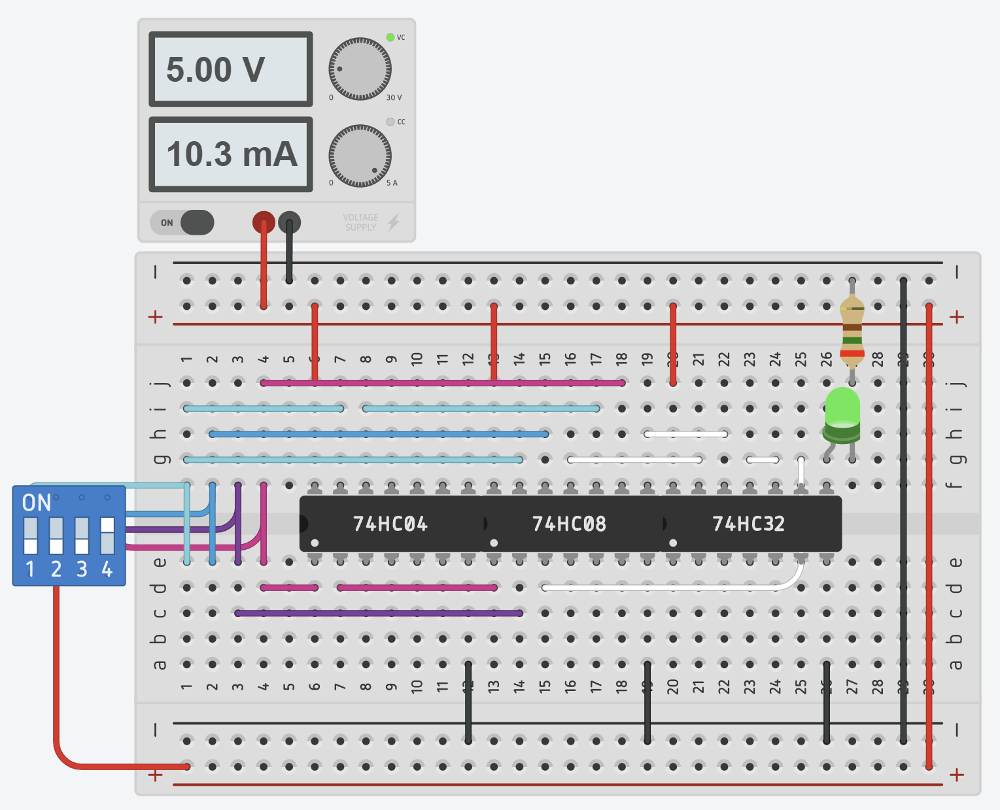
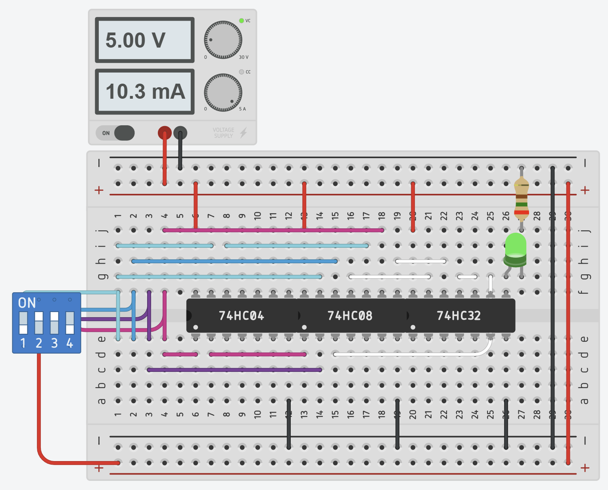
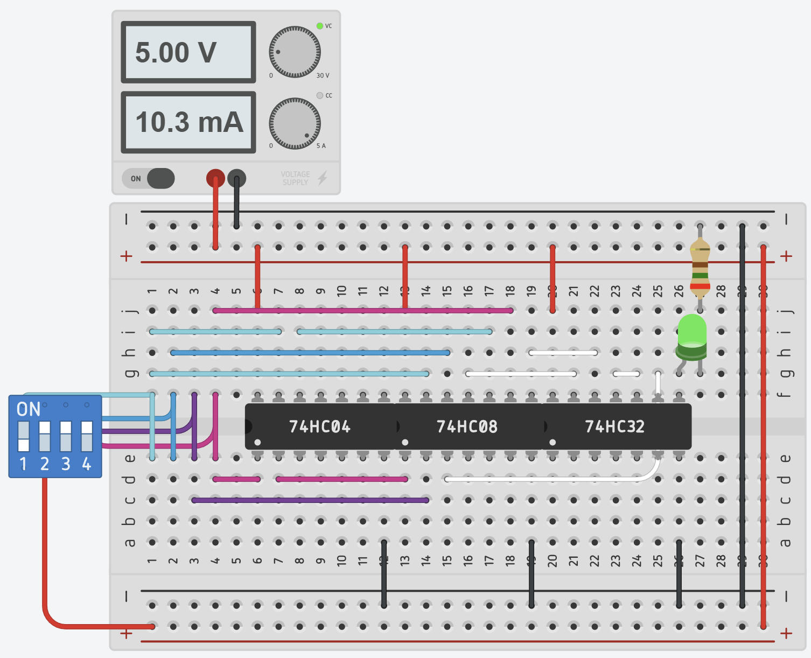
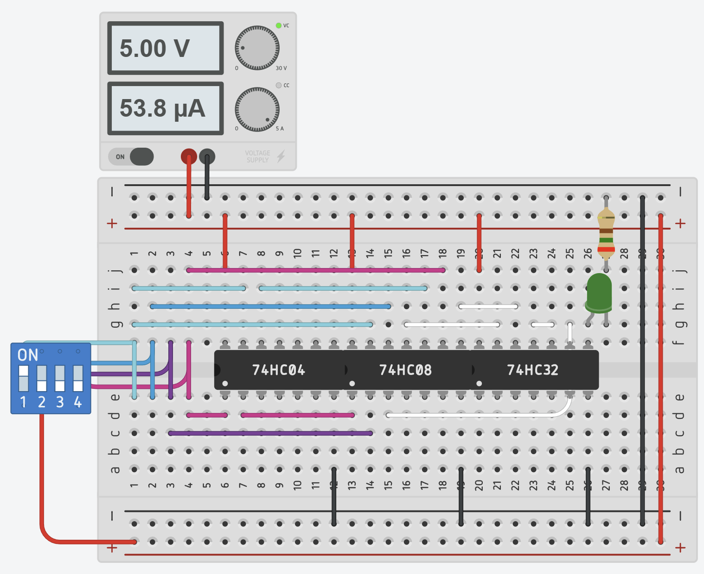
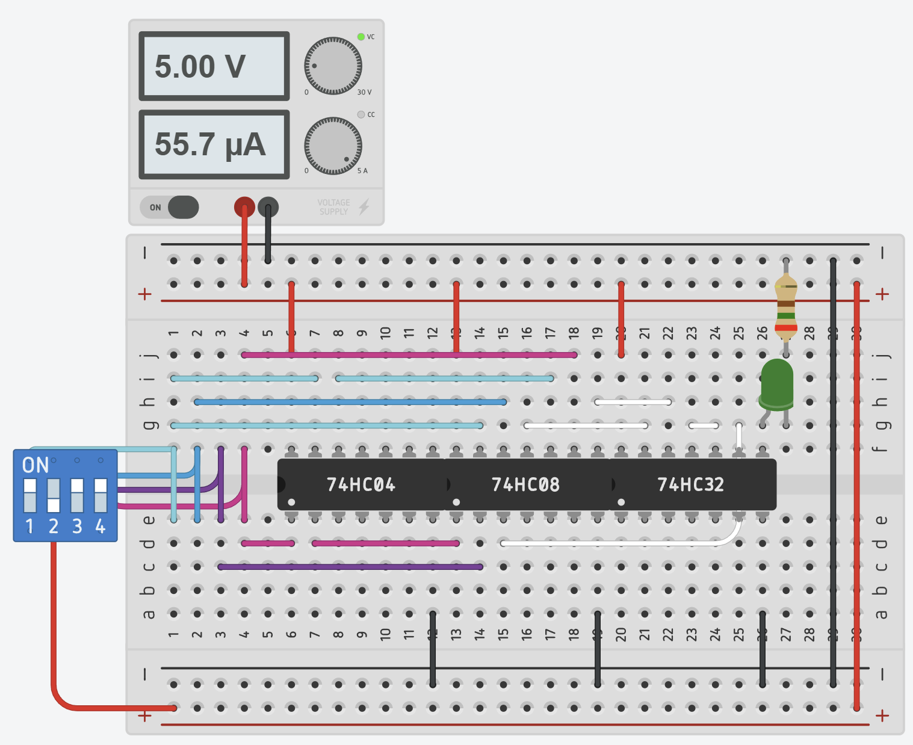
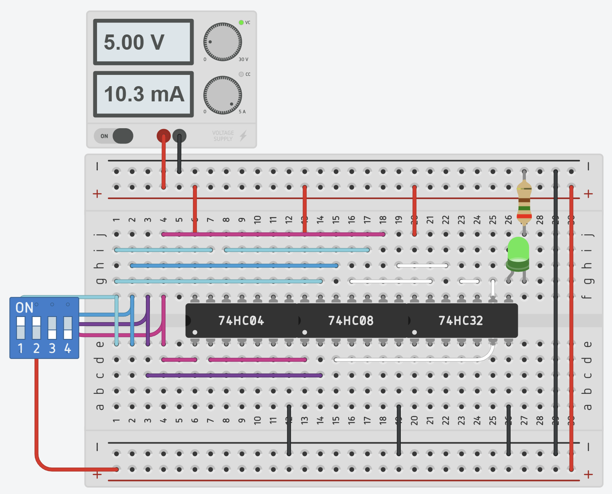
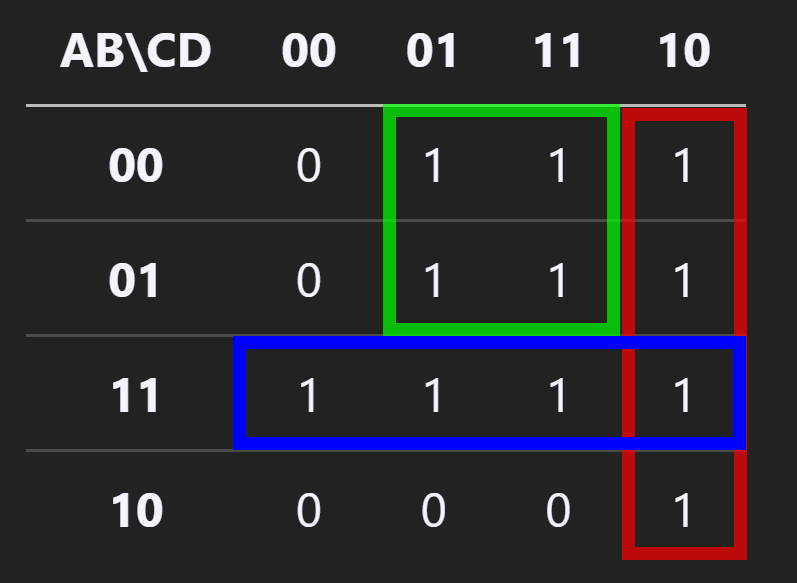

# Tugas Pendahuluan - Karnaugh Map

```txt
Nama: Elias Rechoum

NPM: 2406354045
```

<p style="color:red; font-weight:bold;">
SEBELUM MENGERJAKAN INI HARAP DIPASTIKAN ANDA SUDAH MENONTON VIDEO YANG ADA DI EMAS DAN MEMPELAJARI KMAP DENGAN BAIK. PEMAHAMAN MODUL INI ADALAH PENENTU UTAMA NILAI KALIAN TERMASUK KULIAH NANTI AGAR BISA LULUS/TIDAK (Serius)
</p>


## Teori (40 poin)
## 1. Apa itu K-Map? Apa saja kegunaannya? (10 poin)

Karnaugh Map atau K-Map adalah alat yang digunakan untuk menyederhanakan ekspresi logika dalam aljabar Boolean. K-Map membantu dalam meminimalkan jumlah gerbang logika yang diperlukan dalam sebuah rangkaian digital. Kegunaan utama K-Map adalah untuk menyederhanakan fungsi logika dengan mengelompokkan variabel yang berdekatan dalam truth table, sehingga menghasilkan fungsi boolean yang lebih sederhana.

### Referensi:

- M Morris Mano and M. D. Ciletti, Digital design : with an introduction to the verilog hdl. Boston: Pearson Education Limited, 2013.

## 2. Kapan kita menggunakan K-Map dibanding metode aljabar boolean lain? (5 points)

K-Map digunakan dibanding metode aljabar Boolean lain ketika variabel dalam ekspresi boolean kecil (2 hingga 6), karena K-Map memberikan cara visual yang lebih sederhana dan sistematis tanpa perlu aljabar yang rumit. Metode ini lebih efektif dibandingkan aljabar Boolean manual dalam menemukan ekspresi paling sederhana dengan risiko kesalahan yang lebih rendah.

### Referensi:

- M Morris Mano and M. D. Ciletti, Digital design : with an introduction to the verilog hdl. Boston: Pearson Education Limited, 2013.

## 3. Jelaskan format kotak K-Map dan aturan-aturan dalam mengelompokkan kotak-kotaknya (mana yang bisa dikelompokkan dan mana yang tidak)! (15 poin)

Karnaugh Map (K-Map) untuk 4 variabel terdiri dari 16 kotak dalam format matriks 4×4, di mana setiap kotak mewakili kombinasi biner dari variabel `A,B,C,D` dalam gray code. 

Pengelompokan dalam K-Map harus mengikuti aturan tertentu: kotak yang berisi 1 dapat dikelompokkan dalam ukuran 1, 2, 4, 8, atau 16, dengan setiap kelompok berbentuk persegi atau persegi panjang. Kotak yang bersebelahan secara horizontal atau vertikal dapat digabungkan, tetapi tidak secara diagonal.

Selain itu, K-Map dapat *wrap-around*, yaitu kotak di tepi kiri dapat dikelompokkan dengan kotak di tepi kanan, dan baris atas dengan baris bawah. Untuk menyederhanakan ekspresi boolean, kita harus membentuk kelompok terbesar yang mungkin, dan setiap 1 harus masuk dalam setidaknya satu kelompok. Dengan mengikuti aturan ini, ekspresi boolean dapat disederhanakan secara optimal untuk implementasi rangkaian digital.

### Referensi: 

- M Morris Mano and M. D. Ciletti, Digital design : with an introduction to the verilog hdl. Boston: Pearson Education Limited, 2013.

## 4. Apa itu arti kondisi X / Don't Care? Apa perbedaan X dan 0? Menurut Anda jika ada kondisi tersebut, apakah KMAP menjadi lebih mudah atau susah? (10 poin)

Kondisi X atau Don't Care dalam K-Map adalah keadaan di mana suatu output tidak mempengaruhi output fungsi boolean akhir, sehingga dapat dianggap sebagai 0 atau 1 sesuai kebutuhan untuk menyederhanakan ekspresi.

Kondisi Don't Care membuat K-Map menjadi lebih mudah, karena memungkinkan pembentukan kelompok yang lebih besar, sehingga ekspresi Boolean yang dihasilkan lebih sederhana dan efisien dalam implementasi rangkaian digital.

### Referensi: 

- M Morris Mano and M. D. Ciletti, Digital design : with an introduction to the verilog hdl. Boston: Pearson Education Limited, 2013.


## PreCS (60 poin)

<p style="color:red; font-weight:bold;">
JANGAN PAKE AI (BISA SESAT DAWG NANTI JAWABANNYA 💀 sumpah) & Harap kerjakan sendiri tanpa memakai tools lain yaaa
</p>

Seperti yang sudah kalian tau sebelumnya di CS Modul 2. Selain mencari soulmate, Mister KIM adalah seorang mahasiswa yang sedang mempertimbangkan pindah dari jurusannya karena ~~cewek~~ lingkungannya yang tidak cocok. Ia ingin ke salah satu dari empat fakultas di universitasnya, yaitu : **Teknik (lagi 💀)**, **FMIPA**, **Fasilkom**, atau **FK**. Namun, keputusan pindahnya bergantung pada beberapa kriteria yang harus dipenuhi. Berikut adalah kriteria yang menjadi pertimbangan Mister KIM:

1. **A**: Apakah ia memiliki minat dalam bidang teknis?  
   - `1` = Ya, memiliki minat teknis.  
   - `0` = Tidak memiliki minat teknis.

2. **B**: Apakah ia memiliki nilai matematika yang baik?  
   - `1` = Nilai matematika baik.  
   - `0` = Nilai matematika kurang baik.

3. **C**: Apakah ia memiliki pengalaman dalam pemrograman komputer?  
   - `1` = Memiliki pengalaman pemrograman.  
   - `0` = Tidak memiliki pengalaman pemrograman.

4. **D**: Apakah ia memiliki ketertarikan pada ilmu biologi/kesehatan?  
   - `1` = Tertarik pada biologi/kesehatan.  
   - `0` = Tidak tertarik pada biologi/kesehatan.

Mister KIM akan memutuskan pindah ke salah satu fakultas berdasarkan kombinasi kriteria di atas. Berikut adalah aturan keputusannya:
- **Teknik**: Dipilih jika ia memiliki minat teknis (`A=1`) DAN nilai matematika baik (`B=1`), tetapi tidak terlalu peduli dengan pemrograman (`C=0`).
- **FMIPA**: Dipilih jika ia memiliki nilai matematika baik (`B=1`) DAN tertarik pada biologi/kesehatan (`D=1`).
- **Fasilkom**: Dipilih jika ia memiliki pengalaman pemrograman (`C=1`) DAN tidak tertarik pada biologi/kesehatan (`D=0`).
- **FK**: Dipilih jika ia tertarik pada biologi/kesehatan (`D=1`) DAN tidak memiliki minat teknis (`A=0`).

Namun, Mister KIM hanya dapat memilih **SATU FAKULTAS SAJA**. Oleh karena itu, output dari sistem ini adalah sebuah lampu LED yang menyala untuk menunjukkan apakah Mister KIM memenuhi syarat untuk **setidaknya satu fakultas** (`Output = 1`) atau tidak (`Output = 0`).


Berdasarkan pelajaran yang telah kalian dapat dari Aljabar Boolean, Coba lengkapi truth table ini terlebih dahulu beradasarkan spesifikasi di atas : 
### Truth Table

|  A  |  B  |  C  |  D  | Output | Foto Rangkaian |
|:---:|:---:|:---:|:---:|:------:|:---:|
|  0  |  0  |  0  |  0  |   0    ||
|  0  |  0  |  0  |  1  |   1    ||
|  0  |  0  |  1  |  0  |   1    ||
|  0  |  0  |  1  |  1  |   1    ||
|  0  |  1  |  0  |  1  |   1    ||
|  0  |  1  |  1  |  0  |   1    ||
|  0  |  1  |  1  |  1  |   1    ||
|  1  |  0  |  0  |  0  |   0    ||
|  1  |  0  |  0  |  1  |   0    ||
|  1  |  0  |  1  |  0  |   1    ||
|  1  |  0  |  1  |  1  |   0    ||
|  1  |  1  |  0  |  0  |   1    ||
|  1  |  1  |  0  |  1  |   1    ||
|  1  |  1  |  1  |  0  |   1    ||
|  1  |  1  |  1  |  1  |   1    ||

---

Dari Truth Table yang telah kalian buat, sekarang coba masukkan ke dalam KMAP : 

### Karnaugh Map 

| AB\CD | 00  | 01  | 11    | 10    |
|:-----:|:---:|:---:|:-----:|:-----:|
| **00**|  0  |  1  | 1     |  1   |
| **01**|  0  |  1  | 1     |  1   |
| **11**|  1  |  1  | 1     |  1   |
| **10**|  0  |  0  | 0     |  1   |

---

Kemudian Buatlah Solusinya untuk bisa mendapatkan persamaan boolean (fungsi) paling sederhana nya hanya dengan pengotakan KMAP.

### Solusi Karnaugh Map (dengan kotak-kotak pengelompokan)




### Persamaan Boolean
`F(A,B,C,D) = AB + A'D + CD'`


### Buat rangkaian rumusnya di Tinkercad dan screenshot semua kombinasi untuk menunjukkan setiap output dari seluruh kombinasi input!


|  A  |  B  |  C  |  D  | Output | Foto Rangkaian |
|:---:|:---:|:---:|:---:|:------:|:---:|
|  0  |  0  |  0  |  0  |   0    ||
|  0  |  0  |  0  |  1  |   1    ||
|  0  |  0  |  1  |  0  |   1    ||
|  0  |  0  |  1  |  1  |   1    ||
|  0  |  1  |  0  |  1  |   1    ||
|  0  |  1  |  1  |  0  |   1    ||
|  0  |  1  |  1  |  1  |   1    ||
|  1  |  0  |  0  |  0  |   0    ||
|  1  |  0  |  0  |  1  |   0    ||
|  1  |  0  |  1  |  0  |   1    ||
|  1  |  0  |  1  |  1  |   0    ||
|  1  |  1  |  0  |  0  |   1    ||
|  1  |  1  |  0  |  1  |   1    ||
|  1  |  1  |  1  |  0  |   1    ||
|  1  |  1  |  1  |  1  |   1    ||


### Public Tinkercad Link 

[Link Rangkaian](https://www.tinkercad.com/things/3Jm7M744bIS-tp3-eliasrechoum-2406354045)


### Foto Mister Kim (Doksli) (Aduh Gantengnyo ₊˚⊹♡ )


⠀⠀⠀⠀⠀⠀⠀⠀⠀⠀⠀⠀⢀⡶⠶⢦⣄⠀⠀⠀⠀⠀⣴⠟⠛⢧⣠⣶⣿⠻⣆⠀⠀⠀⠀⠀⠀⠀⠀⠀⠀⠀⠀⠀
⠀⠀⠀⠀⠀⠀⠀⠀⠀⠀⠀⠀⢸⠁⡟⠦⠌⠛⠉⠉⠉⢹⠇⢠⣶⣼⣷⣞⢙⣧⣿⡀⠀⠀⠀⠀⠀⠀⠀⠀⠀⠀⠀⠀
⠀⠀⠀⠀⠀⠀⠀⠀⠀⠀⠀⠀⢸⣤⠃⠀⠀⠀⠀⠀⠀⣿⠀⠈⢻⡃⠀⢸⡿⡄⠈⣿⠀⠀⠀⠀⠀⠀⠀⠀⠀⠀⠀⠀
⠀⠀⠀⠀⠀⠀⠀⠀⠀⠀⠀⠀⣼⠁⠀⠀⠀⠀⠀⠀⠀⠘⠷⠖⠛⠛⠛⢿⡗⢋⣴⠏⠀⠀⠀⠀⠀⠀⠀⠀⠀⠀⠀⠀
⠀⠀⠀⠀⠀⠀⠀⠀⠀⠀⠀⠀⡇⠀⠀⠀⠀⠀⠀⠀⠀⠀⠀⠀⠀⠀⠀⠈⠙⠛⢻⡀⢀⣀⠀⠀⠀⠀⠀⠀⠀⠀⠀⠀
⠀⠀⠀⠀⠀⠀⠀⠀⠀⠀⡶⠾⣷⠆⠀⠀⣤⡀⠀⠀⠀⠀⠀⠀⠀⢀⣤⡀⠀⠐⢺⡟⠉⠉⠀⠀⠀⠀⠀⠀⠀⠀⠀⠀
⠀⠀⠀⠀⠀⠀⠀⠀⠀⠀⢀⣤⢿⡦⠀⠀⠛⠃⠀⠀⢠⢶⣄⠀⠀⠈⠛⠀⠀⠀⣺⠓⠟⠀⠀⠀⠀⠀⠀⠀⠀⠀⠀⠀
⣼⢧⡀⠀⠀⠀⠀⠀⠀⠀⠀⠀⣠⡿⣖⡀⣀⣀⡀⠀⠈⠉⠉⠀⠀⣀⣀⣀⠀⣲⣯⣄⠀⠀⠀⠀⠀⠀⠀⠀⠀⣠⠶⡆
⢻⡈⠻⣦⣀⣀⣀⣀⣀⠀⠀⠀⠁⣴⠟⠉⠁⠀⠉⠛⢦⡀⢀⡴⠛⠉⠁⠈⠙⠻⣄⠀⠁⣀⣠⣤⣤⣤⣤⡤⠖⠋⣸⠇
⡿⠳⣤⣀⡀⠀⠀⠉⠉⠉⠳⢦⣼⠃⠀⠀⠀⠀⠀⠀⠀⠿⠋⠀⠀⠀⠀⠀⠀⠀⠹⣦⡞⠉⠀⠀⠀⠀⠀⢀⣠⠶⢻⡆
⠻⣦⣀⠀⠀⠀⡴⠶⢦⡀⠀⠈⣿⠀⠀⠀⠀⠀⠀⠀⠀⠀⠀⠀⠀⠀⠀⠀⠀⠀⠀⣿⠀⠀⡴⠚⠳⡄⠈⢉⣀⣠⡾⠁
⠀⠸⣍⣉⣁⡀⣇⠀⠀⠑⠀⢠⡿⣆⠀⠀⠀⠀⠀⠀⠀⠀⠀⠀⠀⠀⠀⠀⠀⠀⣰⢷⡀⠀⠓⠀⢀⡇⢤⣈⣭⠿⠁⠀
⠀⠀⠀⠙⠷⠤⠿⠶⠦⠶⠞⠋⠘⢻⣦⡀⠀⠀⠀⠀⠀⠀⠀⠀⠀⠀⠀⠀⢀⡼⠃⠈⠻⠦⠴⠖⠻⠶⠶⠛⠁⠀⠀⠀
⠀⠀⠀⠀⠀⠀⠀⠀⠀⠀⠀⠀⠀⠀⠻⠻⢦⣄⠀⠀⠀⠀⠀⠀⠀⠀⣠⡴⠛⠀⠀⠀⠀⠀⠀⠀⠀⠀⠀⠀⠀⠀⠀⠀
⠀⠀⠀⠀⠀⠀⠀⠀⠀⠀⠀⠀⠀⠀⠀⠀⠀⠉⠛⠶⣄⡀⢀⣤⠶⠋⠁⠀⠀⠀⠀⠀⠀⠀⠀⠀⠀⠀⠀⠀⠀⠀⠀⠀
⠀⠀⠀⠀⠀⠀⠀⠀⠀⠀⠀⠀⠀⠀⠀⠀⠀⠀⠀⠀⠈⠛⠋⠁⠀⠀⠀⠀⠀⠀⠀⠀⠀⠀⠀⠀⠀⠀⠀⠀⠀

꒰♡˃̶̤́ ꒳ ˂̶̤̀ ꒱꒰♡˃̶̤́ ꒳ ˂̶̤̀ ꒱😇😇𓆩♡𓆪𓆩♡𓆪𓆩ꨄ︎𓆪𓆩♡𓆪☆
