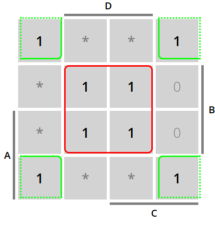

## **TUTAM KMAP: Koh Lex dan Keputusan Menjadi Asisten Lab Digital**

```
Nama : Elias Rechoum
NPM : 2406354045
```


Koh Lex adalah teman dari Mister KIM. Ia adalah seorang mahasiswa DTE jurusan teknik komputer yang sangat antusias dengan dunia digital. Ia sedang berpikir keras apakah ia harus mendaftar menjadi asisten lab digital atau tidak. Namun, keputusannya dipengaruhi oleh beberapa faktor penting. Untuk membantu Alexander membuat keputusan, ia memutuskan untuk menggunakan metode Karnaugh Map (KMAP) agar dapat menganalisis situasi secara logis.


---

### **Latar Belakang Cerita**
Koh Lex memiliki empat fungsi utama yang mempengaruhi keputusannya . Yaitu `Kemampuan`, `Waktu Luang`, `Dukungan Teman`, dan `Tanggung Jawab`.

Input dari masing-masing Fungsi di sini adalah saraf otak kemampuan yapping Koh Lex ketika ingin diinterview Aslab penanggung jawab yang akan menilai Alex. saraf-saraf otak ini bisa anda representasikan dengan `A,B,C,D` seperti biasa tanpa perlu memikirkan nama variabelnya apa.

---

### **Langkah 1: Membuat 4 KMAP Awal (20 Poin)**
Berikut adalah SOM (Sum Of Minterms) dari setiap fungsi utama, karena fungsi Booleannya masih dalam kondisi paling rumit (yang menggambarkan otak Koh Lex sedang tidak fokus). Anda harus buat versi paling sederhananya agar Koh Lex bisa fokus dalam memikirkan keputusannya :

#### **KMAP 1: Faktor "Kemampuan"** (5 Poin)


`F1(A, B, C, D) = A'D+A'B'C'+BCD`

#### **KMAP 2: Faktor "Waktu Luang"** (5 Poin)


`F2(A, B, C, D) = C`  

#### **KMAP 3: Faktor "Dukungan Teman"** (5 Poin)


`F3(A, B, C, D) = B`

#### **KMAP 4: Faktor "Tanggung Jawab"** (5 Poin)
f(A,B,C,D) = Σm(0,2,5,7,8,10,13,15)
d(A,B,C,D) = Σd(1,3,4,9,11,12)


`F4(A, B, C, D) = B'+D`  

---

### **Langkah 2: Menggabungkan Output 4 KMAP Menjadi 1 fungsi Terakhir (10 Poin)**
Setelah membuat 4 KMAP awal, hasil dari masing-masing KMAP (F1, F2, F3, F4) akan menjadi input untuk fungsi terakhir.

Di mana Koh Lex akan memutuskan untuk mendaftar jika ia merasa yakin dengan kemampuannya (F1) DAN memiliki waktu luang (F2), ATAU jika ia merasa didukung oleh teman-temannya (F3) DAN merasa bertanggung jawab (F4).

Fungsi logika:  
`F(F1, F2, F3, F4) = F1 F2 + F3 F4` 

Setelah disederhanakan:

`F(A, B, C, D) = BC' + BD + A'CD` 


---
### Langkah 3: Rangkaian Tinkercad (40 Poin)

|  A  |  B  |  C  |  D  | Output | Foto Rangkaian |
|:---:|:---:|:---:|:---:|:------:|:--------------:|
|  0  |  0  |  0  |  0  |   `0`  |                 |
|  0  |  0  |  0  |  1  |   `0`  |                 |
|  0  |  0  |  1  |  0  |   `0`  |                 |
|  0  |  0  |  1  |  1  |   `1`  |                 |
|  0  |  1  |  0  |  0  |   `1`  |                |
|  0  |  1  |  0  |  1  |   `1`  |                |
|  0  |  1  |  1  |  0  |   `0`  |                |
|  0  |  1  |  1  |  1  |   `1`  |                |
|  1  |  0  |  0  |  0  |   `0`  |                |
|  1  |  0  |  0  |  1  |   `0`  |                |
|  1  |  0  |  1  |  0  |   `0`  |                |
|  1  |  0  |  1  |  1  |   `0`  |                |
|  1  |  1  |  0  |  0  |   `1`  |                |
|  1  |  1  |  0  |  1  |   `1`  |                |
|  1  |  1  |  1  |  0  |   `0`  |                |
|  1  |  1  |  1  |  1  |   `1`  |                |

**Link Tinkercad:** [Link](https://www.tinkercad.com/things/f2k1ShckFhe-tutam-1-elias) 

---

### **Soal Tambahan (TIDAK PERLU REFERENSI)**

### 1. Kira-kira, apa hal yang anda rasa "Baru Dipelajari/Sadar" ketika di tengah mengerjakan Tutam ini? Coba jawab dalam bentuk paragraf saja. **(10 Poin)**

Saya belajar cara menggunakan KMAP untuk menyederhanakan beberapa fungsi boolean, dan cara buat 'loop' KMAP yang ada don't care.

### 2. Jika ingat apa yang kita pelajari kemarin saat sesi praktikum, apa yang terjadi jika saya menghubungkan pin input dengan output sebuah IC? **(5 Poin)**

IC akan meledak.

---

### **Soal Skibidi (Free Poin)**

### 1. Apakah menurut anda Koh Lex akan diterima di digilab jika daftar tahun ini? **(Jawab iya = 5 poin, Jawab tidak = -5 poin :v)**


Iya

### 2. Apakah Hafidz Dwi Febrian sigma?  **(Jawab iya = 3 poin, Jawab tidak = -3 poin :v)**


iya


### 3. Apakah Yu Kai Lun sigma?  **(Jawab iya = 3 poin, Jawab tidak = -3 poin :v)**


iya

### 4. Apakah Danish Fikri Sunjayadi Sigma? **(Jawab iya = 3 poin, Jawab tidak = -3 poin :v)**


iya

### 5. Siapa mahasiswa DTE24 yang menurut Anda paling sigma dan mempesona? (Boleh di luar yang sudah disebutkan), Misal : Nayaka **(1 Poin)**

gua
