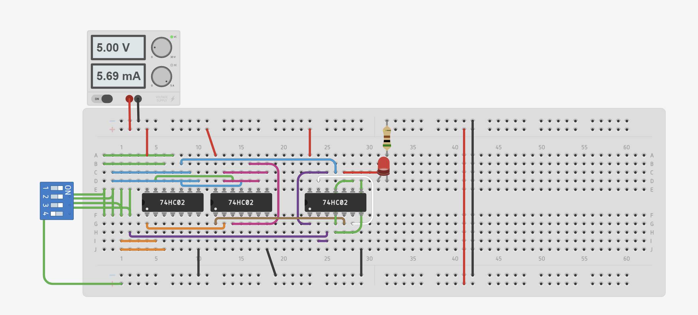

# Tugas Pendahuluan - Gerbang Logika Kompleks

```
Nama  : Elias Rechoum
NPM   : 2406354045
```

## Teori

### 1. Berdasarkan referensi yang anda gunakan, berikan jawaban untuk pertanyaan-pertanyaan berikut! (15 poin)

- **Definisi Gerbang Logika Kompleks**  
  Gerbang logika kompleks adalah kombinasi dari beberapa gerbang logika dasar (AND, OR, NOT) untuk melakukan operasi logika yang lebih kompleks.

- **Definisi Gerbang Logika Universal**  
  Gerbang logika universal adalah gerbang yang dapat digunakan untuk membentuk semua gerbang logika dasar lainnya.

- **Contoh Gerbang Logika Kompleks**  
  Contoh gerbang logika kompleks adalah:  

  - XOR
  - XNOR
  - NAND
  - NOR

### Referensi:  

- “Complex logic gates - Digital data - CCEA - GCSE Digital Technology (CCEA) Revision,” BBC Bitesize. https://www.bbc.co.uk/bitesize/guides/z8qymsg/revision/9

- “Digital Signals and Gates | Logic Gates | Electronics Textbook,” www.allaboutcircuits.com. https://www.allaboutcircuits.com/textbook/digital/chpt-3/digital-signals-gates/

---

### 2. Jelaskan alasan gerbang NAND dan NOR digolongkan sebagai gerbang logika universal! (10 poin)

Gerbang NAND dan NOR digolongkan sebagai gerbang logika universal karena dapat digunakan untuk menyusun semua gerbang logika dasar lainnya. Ini berarti bahwa dengan hanya menggunakan gerbang NAND atau NOR, kita dapat membentuk gerbang AND, OR, dan NOT.

### Referensi:  

- “Realization of Logic Gate Using Universal gates,” GeeksforGeeks, Nov. 15, 2021. https://www.geeksforgeeks.org/realization-of-logic-gate-using-universal-gates/
- - “Digital Signals and Gates | Logic Gates | Electronics Textbook,” www.allaboutcircuits.com. https://www.allaboutcircuits.com/textbook/digital/chpt-3/digital-signals-gates/
‌


---

### 3. Jelaskan mengenai proses konversi gerbang logika NAND dan NOR menjadi AND OR dan NOT (20 poin)

#### **Konversi Menggunakan NAND**

1. **NOT menggunakan NAND:**  
`A NAND A = NOT A`
2. **AND menggunakan NAND:**  
`A NAND B = X`  
`X NAND X = A AND B`
3. **OR menggunakan NAND:**  
`(A NAND A) NAND (B NAND B) = A OR B`

#### **Konversi Menggunakan NOR**

1. **NOT menggunakan NOR:**  
`A NAND A = NOT A`
2. **OR menggunakan NOR:**  
`A NOR B = X`  
`X NOR X = A OR B`
3. **OR menggunakan NOT:**  
(`A NOR A) NOR (B NOR B) = A AND B`


### Referensi:  
- “Universal Logic Gates and Complete Sets,” Basic Electronics Tutorials, Sep. 13, 2019. https://www.electronics-tutorials.ws/logic/universal-gates.html
- “Realization of Logic Gate Using Universal gates,” GeeksforGeeks, Nov. 15, 2021. https://www.geeksforgeeks.org/realization-of-logic-gate-using-universal-gates/

---

### 4. Jelaskan mengenai peran gerbang XOR dan XNOR dalam error checking atau pemeriksaan kesamaan bit (15 poin)

Gerbang **XOR (Exclusive OR)** digunakan dalam error checking karena dapat membandingkan dua bit dan memberikan output tinggi (1) jika kedua bit berbeda. Ini berguna dalam:
- **Parity Check:** Digunakan dalam sistem komunikasi untuk mendeteksi apakah ada bit yang berubah dalam transmisi.  
- **Checksum & CRC (Cyclic Redundancy Check):** XOR digunakan dalam perhitungan checksum untuk mendeteksi perubahan data dalam paket jaringan.

Gerbang **XNOR (Exclusive NOR)** digunakan untuk memeriksa kesamaan dua bit:
- **Komparator Digital:** XNOR menghasilkan 1 jika dua input sama, sehingga digunakan dalam sirkuit pencocokan bit.  
- **Pemeriksaan Integritas Data:** Dalam beberapa sistem, XNOR membantu dalam mendeteksi perbedaan antara data asli dan data yang diterima.


### Referensi:  
- “Physics Exclusive - OR gate (XOR Gate),” Unacademy. https://unacademy.com/content/jee/study-material/physics/physics-exclusive-or-gate-xor-gate/
- “Definition of XOR,” PCMAG. https://www.pcmag.com/encyclopedia/term/xor
‌

## Praktik (35 Poin)

**Persyaratan:**
1. Gunakan [Tinkercad](https://www.tinkercad.com)  
2. Gunakan resistor 500-ohm untuk LED  

---

Lakukan konversi rangkaian berikut sehingga menggunakan gerbang logika universal. Bila NPM anda berakhiran dengan bilangan genap (2206059590), gunakan gerbang NAND, bila NPM anda berakhiran dengan bilangan ganjil (2206059591), gunakan gerbang NOR. Sertakan proses konversi dan rangkaian hasil konversi anda.

Rangkaian yang di Konversi :
- F(A, B, C, D) = (AB + CD)*BC + BD

1. Sederhanakan Fungsi: `F(A,B,C,D) = ABC+BD
2. Ganti ke NOR: 

```txt
ABC = (((A NOR A) NOR (B NOR B)) NOR (C NOR C))

BD = (B NOR B) NOR (D NOR D)

(ABC NOR BD) NOR (ABC NOR BD)
```

Sertakan **SCREENSHOT** dan **LINK** ke simulasi Tinkercad. Pastikan link tersebut **PUBLIC**.

---

**Screenshot:**  


**Link:** [Link Tinkercad](https://www.tinkercad.com/things/doI6XOzW5zn-elias-2406354045)  