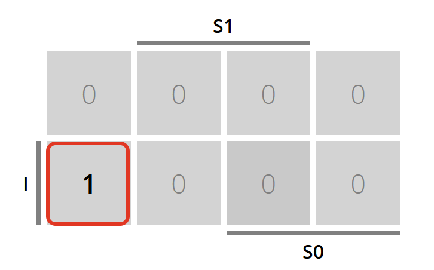
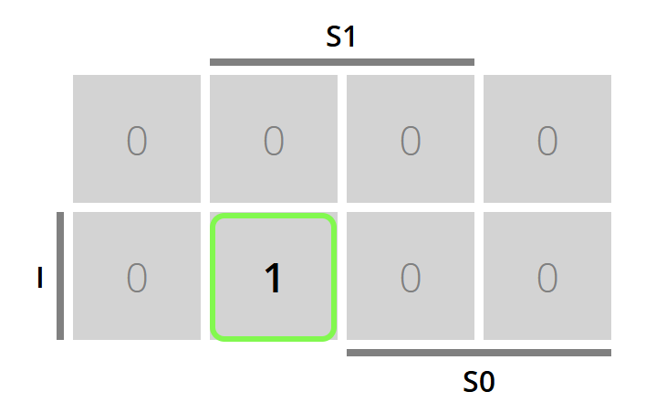
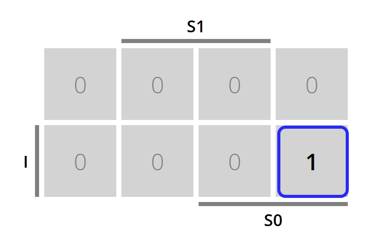
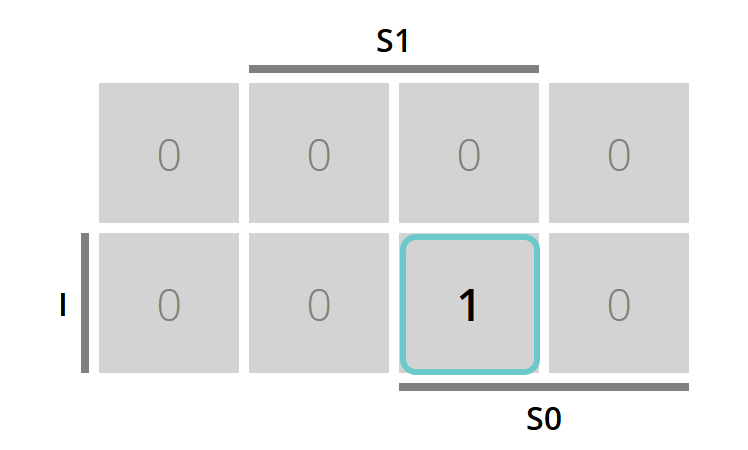
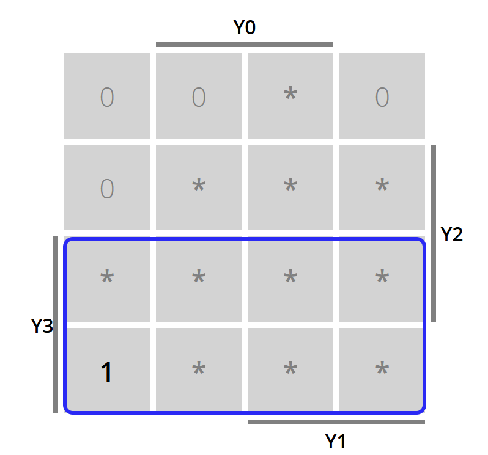
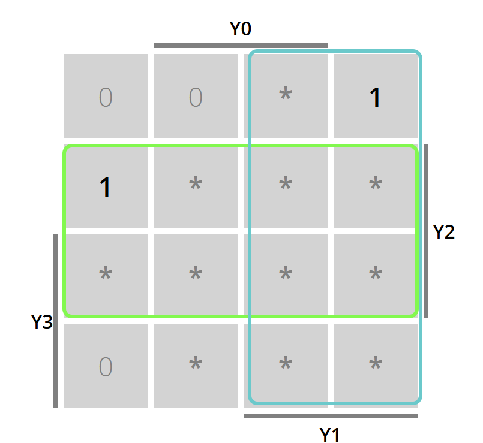
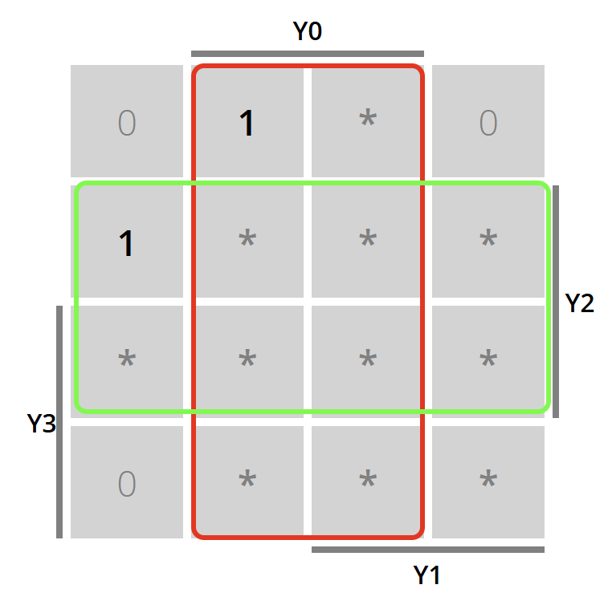
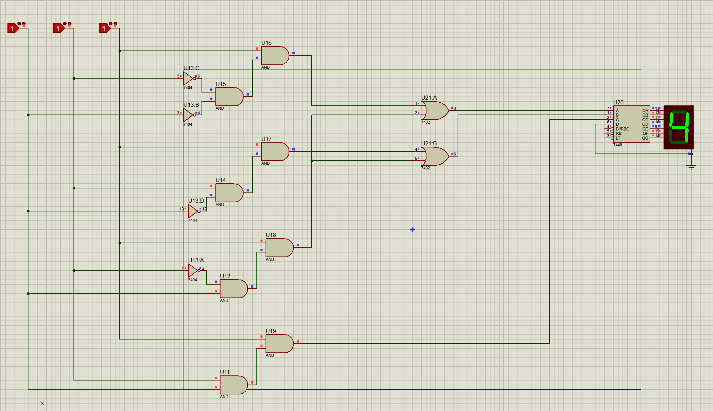

# Case Study - 5 & 6

```
Nama: Elias Rechoum
NPM : 2406354045
```

## Rangkaian (60 Poin)

Mr. Kim baru-baru ini ketahuan selingkuh oleh soulmate pertamanya dan dipukuli hingga nyaris `wassalam`, jadi ia tidak akan memberi pekerjaan Anda kali ini. 


Sebagai gantinya, teman SD Mr. Kim, Lukman, mendengar keampuhan `Soulmate Decoder` Anda, dan meminta bantuan untuk membuat satu bagi preferensinya.

Berdasarkan preferensi Lukman, ia menyimpulkan bahwa soulmate yang ia inginkan **wajib memiliki 1 ciri-ciri**, yaitu `Ceria` sebagai kriteria paling minimum untuk soulmate-nya, karena kehidupan di Teknik Elektro:tm: sudah cukup stres baginya dan ia butuh orang yang dapat membantunya naik. Jadi, 2 sifat selain itu opsional, yaitu Apresiatif (`S0`) dan Banyak Uang (`S1`).

Ia juga sedang memikirkan suatu hadiah yang akan selalu diberikan kepada "Soulmate"-nya ketika menghabiskan waktu bersama pada saat hari libur (`I`) berdasarkan `sifat opsional` yang dimiliki oleh soulmatenya. Selain sebagai tanda apresiasi, ini juga investasi masa depan agar tidak dipukuli saat cekcok seperti Mr. Kim. Berikut adalah daftar hadiahnya :

- Hadiah pertama yaitu Ciki (`Y0`) ketika soulmatenya tidak Apresiatif dan tidak Banyak Uang
- Hadiah kedua yaitu Bunga (`Y1`) ketika soulmatenya tidak Apresiatif tetapi Banyak Uang
- Hadiah ketiga yaitu Laptop (`Y2`) ketika soulmatenya Apresiatif tetapi tidak Banyak Uang
- Hadiah keempat yaitu Motor (`Y3`) ketika soulmatenya Apresiatif dan juga Banyak Uang

Buatlah rangkaian penentu hadiah soulmate Lukman berdasarkan spesifikasi di atas dengan menggunakan IC Logic Gate !

```
Hint : Anda intinya diminta untuk membuat komponen demultiplexer 1 to 4
```

### 1. Truth Table
| **I** | **S0 (Apresiatif)** | **S1 (Banyak Uang)** | **Y3 (Motor)** | **Y2 (Laptop)** | **Y1 (Bunga)** | **Y0 (Steak)** |
|:-----:|:-------------------:|:--------------------:|:--------------:|:---------------:|:--------------:|:--------------:|
|   0   |          0          |          0           |      `0`       |       `0`       |      `0`       |      `0`       |
|   0   |          0          |          1           |      `0`       |       `0`       |      `0`       |      `0`       |
|   0   |          1          |          0           |      `0`       |       `0`       |      `0`       |      `0`       |
|   0   |          1          |          1           |      `0`       |       `0`       |      `0`       |      `0`       |
|   1   |          0          |          0           |      `0`       |       `0`       |      `0`       |      `1`       |
|   1   |          0          |          1           |      `0`       |       `0`       |      `1`       |      `0`       |
|   1   |          1          |          0           |      `0`       |       `1`       |      `0`       |      `0`       |
|   1   |          1          |          1           |      `1`       |       `0`       |      `0`       |      `0`       |

### 2. KMAP

---

#### Y0



`Y0 = IS0'S1'`

#### Y1



`Y1 = IS0'S1`

#### Y2 



`Y2 = IS0S1'`


#### Y3



`Y3 = IS0S1`

### 3. Buat rangkaiannya berdasarkan KMAP yang kalian peroleh dengan outputnya adalah LED (4 Buah LED)


### *Jika Anda telah menyelesaikan rangkaian demultiplexer hingga nomor 3 dan waktu praktikum sudah habis, Anda dapat melanjutkan pengerjaan nomor 4 di Proteus.

### 4. Mirip dengan yang kalian kerjakan di Tugas Pendahuluan. Sambungkan output rangkaian demultiplexer kalian ke 7 segment Decoder untuk menampilkan hadiah ke-berapa yang akan diterima oleh soulmate Lukman

Note: Pertama-tama, Anda perlu membuat **custom encoder** untuk memetakan output dari Demultiplexer yang tadi dibuat ke `000` (0), `001` (1), `010` (2), `011` (3), dan `100` (4) pada input CBA di 7 segment Decoder (IC 7447/7448). 

Note extra, pin D dari decoder 7447/7448 dapat dihubungkan ke Ground karena tidak digunakan (karena D hanya digunakan ketika angka kita lebih besar dari 3 bit, dan angka maksimum yang ingin kita tampilkan hanya `100` = 4, yang memiliki lebar 3 bit biner).

##### Hint : Kalau Y3 bernilai 1, maka CBA = `100` (4) karena Y3 = Motor yang merupakan hadiah ke-empat, dan 7 segment akan menampilkan angka yang juga sesuai dengan hadiahnya. Jika semua Y3 sampai Y0 adalah 0 karena bukan hari libur (I = 1) maka 7 segment akan menampilkan angka "0" karena tidak ada hadiah yang diberikan. Untuk Input yang tidak mungkin terjadi (contoh, tidak mungkin lebih dari satu Y bernilai 1, pasti hanya ada satu yang bernilai 1 karena ini output demux, contoh yang tidak mungkin misalkan `0011,0101,0110`,dll.), maka outputnya isi saja dengan X (Dont care).

#### Truth Table

| **Y3** | **Y2** | **Y1** | **Y0** | **`C`** | **`B`** | **`A`** |
|:------:|:------:|:------:|:------:|:-------:|:-------:|:-------:|
|   0    |   0    |   0    |   0    |    `X`  |    `X`  |    `X`  |
|   0    |   0    |   0    |   1    |    `0`  |    `0`  |    `1`  |
|   0    |   0    |   1    |   0    |    `0`  |    `1`  |    `0`  |
|   0    |   0    |   1    |   1    |    `X`  |    `X`  |    `X`  |
|   0    |   1    |   0    |   0    |    `0`  |    `1`  |    `1`  |
|   0    |   1    |   0    |   1    |    `X`  |    `X`  |    `X`  |
|   0    |   1    |   1    |   0    |    `X`  |    `X`  |    `X`  |
|   0    |   1    |   1    |   1    |    `X`  |    `X`  |    `X`  |
|   1    |   0    |   0    |   0    |    `1`  |    `0`  |    `0`  |
|   1    |   0    |   0    |   1    |    `X`  |    `X`  |    `X`  |
|   1    |   0    |   1    |   0    |    `X`  |    `X`  |    `X`  |
|   1    |   0    |   1    |   1    |    `X`  |    `X`  |    `X`  |
|   1    |   1    |   0    |   0    |    `X`  |    `X`  |    `X`  |
|   1    |   1    |   0    |   1    |    `X`  |    `X`  |    `X`  |
|   1    |   1    |   1    |   0    |    `X`  |    `X`  |    `X`  |
|   1    |   1    |   1    |   1    |    `X`  |    `X`  |    `X`  |

#### KMAP



`C = Y3`



`B = Y2+Y1`


`A = Y0+Y2`



## Analisis & Teori (40 Poin)

### 5. Analisis IC apa saja yang Anda gunakan untuk rangkaian ini beserta kegunaannya. Berikan analisis kesalahan apabila output tidak sesuai atau jika rangkaian tidak selesai. (10 poin)

IC yang dipakai hanya NOT, AND, dan OR untuk demux dan decoder.

Output Rangkaian fisik tidak sesuai karena permasalahan dengan board vulcan. Rangkaian proteus yang disubmit dengan CS ini adalah rangkaian yang kita mencoba untuk merakit, tetapi output tidak sesuai.  

Di rangkaian proteus terdapat demux dan demux yang terhubung ke decoder yang terhubung ke 7 segment.

### 6. Jika kita ingin mengecek komponen 7 segment rusak atau tidak menggunakan IC 7447 ataupun 7448, terdapat 1 pin yang berguna untuk ini, pin input apa yang harus kita atur? (Tidak boleh menggunakan pin input ABCD) (10 poin)

Pin yang bisa digunakan untuk mengecek komponen 7 segment adalah Lamp Test (LT). Jika LT LOW, maka semua segment pada 7 segment akan menyala.

### 7. Buatlah kesimpulan yang kalian dapatkan dari praktikum kali ini dalam bentuk poin-poin minimal 3 ! (20 poin)

- Saya belajar cara buat dan pakai demultiplexer untuk mengubah 1 bit jadi 4 bit.
- Saya belajar cara membuat decoder untuk masuk input ke 7 segment.
- Saya belajar cara memakai KMap untuk membuat demux dan decoder.