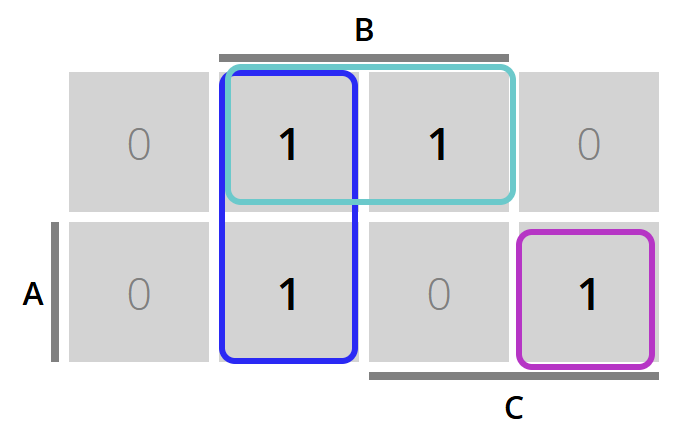

# Tugas Pendahuluan - Decoder / Encoder & Multiplexer / Demultiplexer
```
Nama  : [nama Anda di sini]  
NPM   : [NPM Anda di sini]
```
## Teori (50 poin)

### 1. Jelaskan apa perbedaan antara `Mutliplexer` dengan `Demultiplexer` secara lengkap. Anda boleh menjelaskan dari segi fungsionalitas serta bit input dan output sekaligus IC apa yang dipakai.

|              | Multiplexer (MUX)                                                                                 | Demultiplexer (DEMUX)                                                                                   |
|-------------------|---------------------------------------------------------------------------------------------------|---------------------------------------------------------------------------------------------------------|
| **Fungsi**        | Menggabungkan beberapa sinyal input menjadi satu sinyal output.  | Mendistribusikan satu sinyal input ke beberapa sinyal output.|
| **Jumlah Input**  | Beberapa sinyal input.  | Satu sinyal input.  |
| **Jumlah Output** | Satu sinyal output.  | Beberapa sinyal output.  |
| **Sinyal Kontrol**| Menggunakan sinyal kontrol untuk memilih input mana yang akan diteruskan ke output.  | Menggunakan sinyal kontrol untuk memilih output mana yang akan menerima sinyal input.  |
| **Aplikasi**      | Digunakan dalam komunikasi data untuk mengirimkan beberapa sinyal melalui satu saluran transmisi.  | Digunakan untuk mendistribusikan sinyal tunggal ke beberapa perangkat output.  |


### Referensi:  

- “Difference between Multiplexer and Demultiplexer,” GeeksforGeeks, May 05, 2020. https://www.geeksforgeeks.org/difference-between-multiplexer-and-demultiplexer/

### 2. Jelaskan apa yang dimaksud dengan `Active Low` secara singkat, beserta contoh komponen yang bisa dikatakan sebagai `Active Low`!

Sebuah pin `Active Low` adalah sebuah pin yang akan aktif ketika inputnya `LOW` atau `0`.

Contoh komponen yang bisa dikatakan active low adalah `RESET` pin pada microcontroller, dan pin `Chip Enable` (`CE`) pada beberapa IC.

### Referensi:  

- “Logic Levels - learn.sparkfun.com,” learn.sparkfun.com. https://learn.sparkfun.com/tutorials/logic-levels/active-low-and-active-high
- “active-low,” Tidjma.tn, 2023. https://www.tidjma.tn/en/electrical/active-low-/

### 3. Sebutkan satu saja contoh praktik/kegunaan dari `Priority Encoder` yang sebenarnya ada di dalam kehidupan sehari-hari/lingkungan sekitar kalian

Satu kegunaan dari `Priority Encoder` adalah untuk *interrupt controller*, karena bit yang punya prioritas lebih tinggi akan override bit yang prioritasnya lebih rendah.

### Referensi:  

- “Priority Encoder and Digital Encoder Tutorial,” Basic Electronics Tutorials, Aug. 2013. https://www.electronics-tutorials.ws/combination/comb_4.html

## Intro to Proteus-8 (10 poin)

### 4. Dengan menggunakan Proteus, buatlah sebuah rangkaian sederhana yang dapat menyalakan satu lampu LED (warna terserah kalian) menggunakan pin power,ground dan komponen switch. Jangan lupa untuk memberikan Teks berupa `Nama_NPM` pada rangkaian sesuai video tutorial yang sudah diberikan di Emas2.

Screenshot Rangkaian : 

## Rangkaian Asli (40 Poin) 

`Note : Rangkaian dibuat di dalam file yang sama dengan pengerjaan nomer 4`

Apakah Anda masih ingat dengan Mr. Kim? Beberapa minggu lalu, Anda telah membantu Mr. Kim mencari soulmate untuk menemani kehidupannya yang tragis ini berdasarkan preferensi yang ia punya dengan menggunakan Aljabar Boolean

Sekarang, karena aspek penganggurannya, Mr. Kim sudah kehabisan uang akibat terlalu sering mentraktir soulmate barunya. Sebagai *backup plan*, ia memberi sebuah misi lagi untuk Anda. Ia ingin membuat sebuah sistem "Rating" untuk kriteria soulmate terbarunya dengan (A,B,C) merepresentasikan: 
A = Amal
B = Banyak berdoa
C = Cantik

Rating yang dimaksud di sini adalah skor "kecocokan" orang tersebut untuk menjadi soulmate Mr. Kim. Makin lengkap kriteria pasangan tersebut, makin tinggi juga ratingnya. Peraturan dari rating ini diantaranya : 
- Rating memiliki lebar 4 bit dengan angka maksimal 9 poin
- Banyak berdoa memiliki rating sebesar 4 poin
- Amal memiliki rating sebesar 3 poin
- Cantik memiliki rating sebesar 2 poin

Seperti ekspektasi, orang yang berada di sekitar Mr. Kim diminta untuk dinilai dari sifat yang mereka punya sesuai kriteria yang diminta.

### 5. Buatlah Custom Decoder untuk membantu Mr. Kim sesuai spesifikasi yang diminta di atas

***Hint : Anda diperbolehkan menggunakan Logic State dan Logic Probe sebagai input/output sesuai dengan video tutorial yang sudah diupload di Emas2***

Truth Table 
| A (Amal) | B (Banyak berdoa) | C (Cantik) | D3 | D2 | D1 | D0 |
|:--------:|:-----------------:|:----------:|:--:|:--:|:--:|:--:|
|     0    |         0         |      0     |  0 |  0 |  0 |  0 | 0
|     0    |         0         |      1     |  0 |  0 |  1 |  0 | 2
|     0    |         1         |      0     |  0 |  1 |  0 |  0 | 4
|     0    |         1         |      1     |  0 |  1 |  1 |  0 | 6
|     1    |         0         |      0     |  0 |  0 |  1 |  1 | 3
|     1    |         0         |      1     |  0 |  1 |  0 |  1 | 5
|     1    |         1         |      0     |  0 |  1 |  1 |  1 | 7
|     1    |         1         |      1     |  1 |  0 |  0 |  1 | 9

KMAP : 

### D0


### D1


### D2


### D3


Screenshot Rangkaian : 


### 6. Buatlah satu lagi Rangkaian Custom Decoder yang mempunyai sedikit peraturan berbeda, di mana nilai/rating dari setiap kriteria sesuai dengan representasi `2^n` nya , sehingga Amal = 4 poin, Banyak berdoa = 2 poin, Cantik = 1 poin.

***Hint : Rangkaian ini tidak perlu menggunakan K-MAP, untuk output yang tidak terhubung dengan input apapun karena selalu bernilai 0 tetap biarkan saja berada di rangkaian*** 

Screenshot Rangkaian : 


### 7. Tugas terakhir Anda adalah membuat custom multiplexer menggunakan Logic Gates (Dilarang menggunakan IC Multiplexer bawaan) yang dapat meneruskan/memilih 2 jenis input, yaitu output fungsi decoder nomer 5 dan 6. Output dari multiplexer ini adalah 4 bit sesuai dengan lebar angka rating yang tadi sudah dijelaskan. Setelah membuat custom multiplexer ini, Anda harus menghubungkan outpux multiplexer tersebut ke tampilan 7 segment dengan menggunakan Decoder agar nilai/rating dapat ditampilkan agar mudah dibaca oleh Mr. Kim (Boleh menggunakan IC Bawaan seperti 7447 ,dll.)


#### Sedikit arahan: Dengan custom multiplexer yang diinstruksikan, total input yang kalian punya akan berjumlah 9 bit pada multiplexer tersebut, dengan outputnya adalah 4 bit. Input Selector dari multiplexer ini adalah 1 bit karena hanya ada 2 jenis input yang ingin dipilih, yaitu 4 bit input berupa output fungsi nomer 5 dan 4 bit input berupa output fungsi nomer 6. Dari sini, sebenarnya yang kalian buat adalah `Quadruple 2x1 Multiplexer` . Anda dapat mempelajari terkait `Quadruple 2x1 Multiplexer` dari internet untuk mencari bentuk rangkaian logika multiplexer ini sebagai jawaban nomer 7.

Screenshot Rangkaian : 

