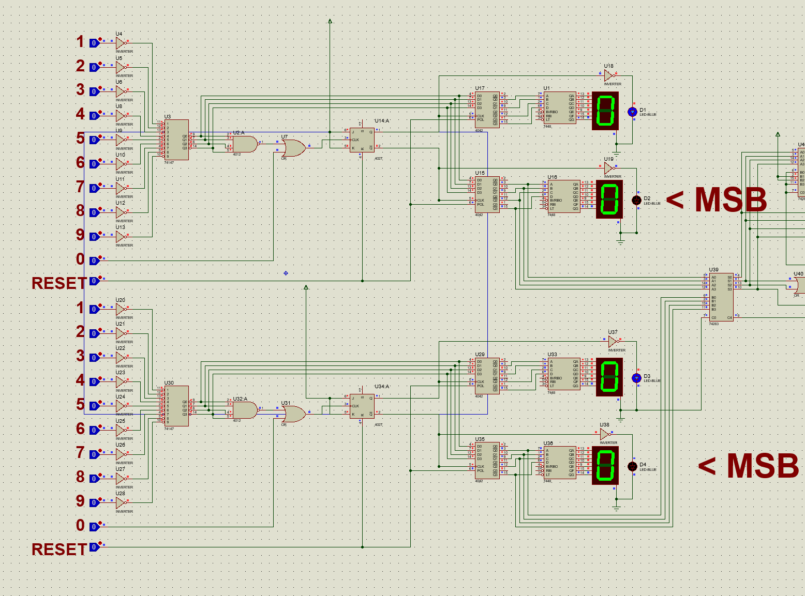
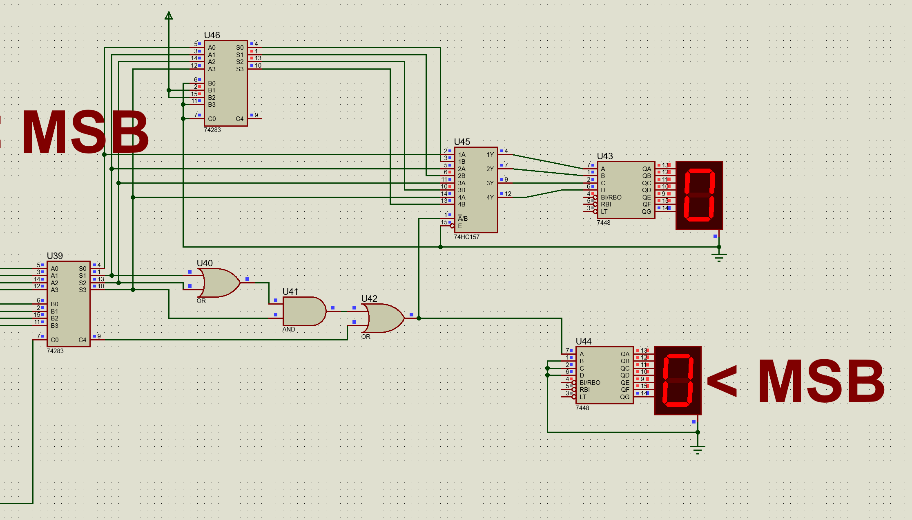
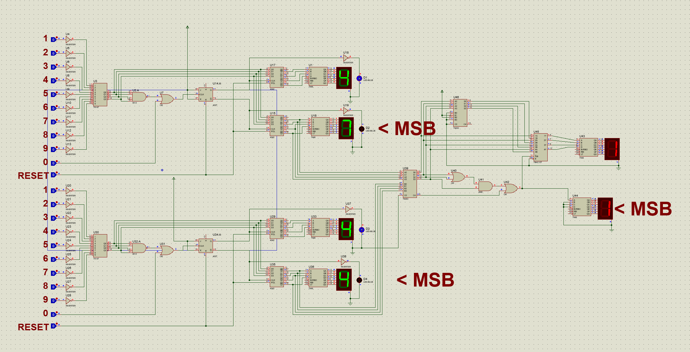
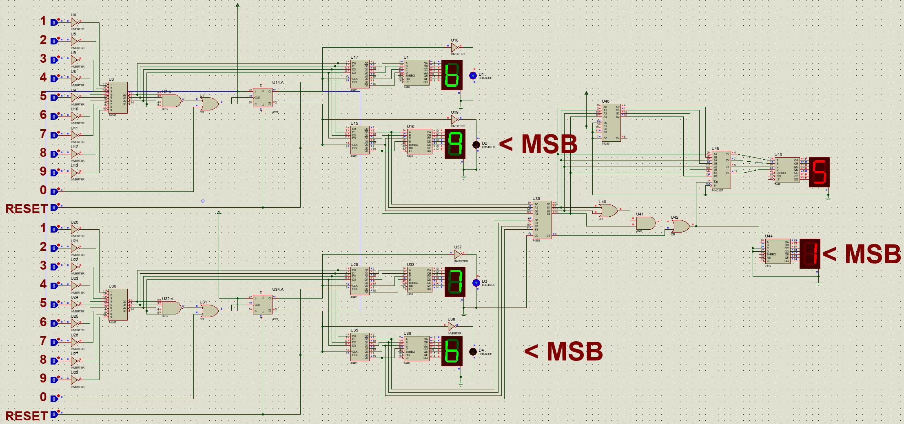
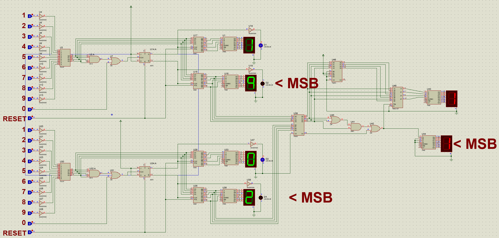
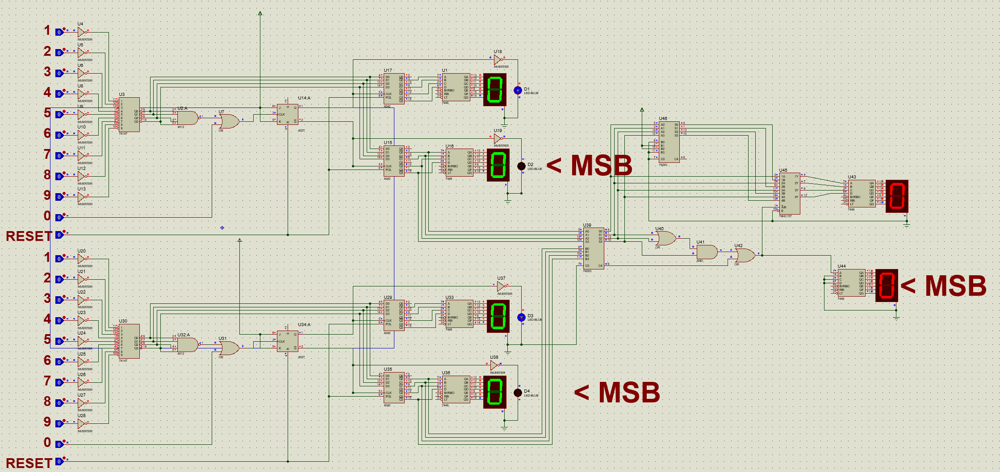

---
title: Modul 789 - Tugas Tambahan
---

# Modul 789 - Tugas Tambahan

```
Nama    : Elias Rechoum
NPM     : 2406354045
```

_Epilog - Pengenalan untuk Proyek Akhir_
Setelah melalui satu semester penuh di lab ini, saatnya Anda mengaplikasikan ilmu yang didapat untuk menciptakan sesuatu yang bermanfaat!

## Rangkaian (90 Poin)

Tujuan dari tugas tambahan ini adalah untuk membuat sebuah **keypad + kalkulator sederhana**.
Pertama, berikut adalah visualisasi untuk **display** 7-segment.

**State Awal**


**Input 5**


**Input 8**


**Input 4**


**Input 2**


### Algoritma General

-   Mulai dari 00, posisi "kursor" di angka paling kiri
-   Saat tombol ditekan, translasi angka ke dalam biner, lalu simpan di posisi kursor saat ini
- Kursor akan bergerak ke kanan, dan kembali ke kiri (**loop around**)
Untuk mencapai hal ini:

### a. Keypad

Keypad akan terdiri dari **11 tombol**. 10 adalah dari 0-10, dan 1 adalah **tombol reset** (mengembalikan semua digit ke 0, jadi isi keypad menjadi 00)

Untuk mengubah input tombol ini menjadi angka sebenarnya, Anda dapat membuat _priority encoder_ custom, atau menggunakan IC **MM74C922** (Keyboard Encoder).


IC ini dapat menjadi "translator" untuk mengubah input tombol menjadi bilangan biner (catatan: sambungkan pin **KBM dan OSC** ke 2 kapasitor 1 mikrofarad. Selain itu, pin **DA** memberi tahu apakah tombol tersebut sedang ditekan (1) atau jika tidak ada tombol yang ditekan (0)).


Sekarang, coba uji output ke 4 LED/7Seg untuk memeriksa apakah tombol sudah dapat diterjemahkan ke biner yang tepat! (tidak perlu mengambil screenshot bagian ini).

### b. Bit Selector

Untuk memberi tahu rangkaian bit mana yang akan diubah oleh input selanjutnya, Anda bisa langsung menggunakan **d flip-flop** yang beraksi sebagai sebuah **counter 1-bit**. Saat Q = 0, maka digit pertama akan diubah, dan saat Q = 1, digit kedua yang diubah. Output ini akan disambungkan ke IC 74192 untuk menentukan digit mana yang berubah.

_Hint_


### c. 7-Segment

Kemudian, output yang diproses dari 74192 masing-masing dihubungkan ke sebuah decoder 7-segmen, sebelum akhirnya dihubungkan ke tampilan 7-segmennya (1 set keluaran 4 bit dari MM74C922 -> 4 IC 74192 -> 4 7-seg).

_Hint_


## Jadi, alur general keypad adalah
- Counter (0 - 1 - 0 - 1) menentukan angka yang akan diubah
- Saat keypad ditekan dan ditranslasi oleh 74922, angkanya akan diteruskan ke kedua 7-segment
- Akan tetapi, hanya salah satunya yang berubah, yaitu indeks digit yang ditunjuk oleh counter 1-bit. Ini dilakukan lewat pin PL pada 74912 (mirip seperti enable)

### d. Exploration Part : Reset Button

Untuk tombol reset, yang perlu Anda lakukan hanyalah "memaksa" ke-4 angka kembali ke 0000, jadi, Anda harus mengaturnya kembali ke 0000 - 0000 - 0000 - 0000 dan mengembalikan **kursor** ke posisi paling kiri.

### e. Exploration Part : Adder Sederhana

Setelah rangkaian Anda berfungsi dengan benar, buat 1 unit lagi (konfigurasi persis). **Anda bisa langsung menggunakan fitur block copy Proteus untuk keypad kedua (highlight / kotakkan seluruh rangkaian, lalu klik kanan -> block copy), tapi jangan lupa pastikan tidak ada label / komponen dengan nama yang sama, agar tidak mengalami bug.**

Setelah itu, hubungkan digit ke-2 dari masing-masing keypad ke adder berantai, dan tampilkan hasil penjumlahannya ke 7-segment tambahan! (2-bit, jadi min: 00, max: 18).

Contoh:
Angka 1 : 24 (digit ke-2 adalah 4)
Angka 2 : 78 (digit ke-2 adalah 8)
Maka, hasil di adder sederhana akan menunjukkan 12.


## Circuit Photo & Final Conclusion

### 1. Screenshot rangkaian **keypad** Anda!



### 2. Screenshot **adder dan kalkulator 2 digit** Anda!



### 3. Screenshot hasil 7-seg Anda dan tunjukkan fungsionalitas sirkuit Anda! (3 foto memasukkan angka, 1 foto hasil penjumlahan, dan 1 foto saat direset)










### 4. Berikan kesan dan pesan selama praktikum DSD di DigiLab, minimal 2 Paragraf! (10 poin)
